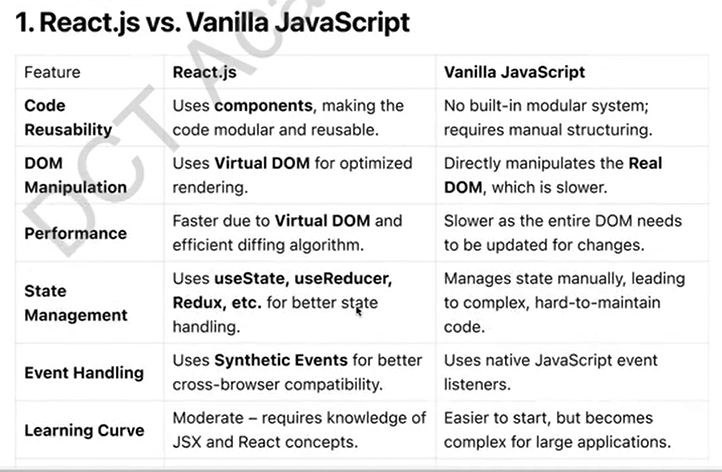

# Components

1. Class based Components
2. Functional Components


- Before **React** , **J Query** was using and it was more popular than react js on that time.

- Since 2000 to 2015, the most popular library was called as **jQuery** . <br> It did a lots of things that React is doing today.

# Q). What is React ? <br>
ans: **React.js** is a popular **JavaScript library** used for building fast and interactive **user interfaces (UIs)**, primarily for **single-page applications (SPAs).**

- It was developed by Facebook(now meta) and is open-source. 

- React is widely used because of its component-based architecture, virtual DOM, and efficient rendering capabilities.

Q). What is library ? <br>
ans: library contained basically, predefined functions. (few pre-defined fn, i.e something that's we use in day to day life). e.g: react

Q) What is framework ? <br>
ans: framework has all the tools(built-in tool) necessary for development. e.g: Angular

- Angular JS is a framework, whereas React Js is a library.
  
- In **react**, we have to depend on multiple 3rd party library and packages. <br> that is lots of 3rd party things has to be used. <br>

- Where as in framework, everything is inbuilt.


### Q). If Angular(framework) gives us everything that is necessary for development, then why is React more popular ? <br>
ans: Because libraries gives us a freedom of choice. Here we can choose what we want. <br>

e.g: We use **chartkick and fusion-chart** in recent project , so there is **choice in react** what would i like to choose. but **there is no choice in angular.** <br>
This is why **React** is more popular than **Angular**.


### Q). Why Use React.js ? <br>
ans:

- Component-Based Architecture - **Breaks the UI** into reusable, self-contained components.
  
- Virtual DOM(VDOM) - Optimizes rendering by updationg only changed parts of the UI.
  
- One-Way Data Binding - Ensures better control over data flow, making debugging easier.

- Fast & Efficient - Uses declarative programming and updates only necessary elements.

- Strong Community & Ecosystem - Supported by Meta and widely used in the industry.
  
- SEO Friendly - Can be optimized with **SSR** (Server-Side Rendering) using **Next.js.**

- Cross-Platform Development - React Native allows building mobile.

<br>

=> **Component** is nothing, but a function. <br>

=> **React website** are not SEO(range website in google) friendly, that is **why we use Next.js.** Next.js is also a cross-platform development. <br>

=> using React-Native, we can also build android as well as ios mobile application. <br> 
**So, If you know React then 75% of the React Native, we already knew.** only 25 % extra we have to learn to build mobile applications.


# Core Concepts of React.js

- Components : <br>
React applications are built using components, which are reusable pieces of UI. 
<br>

There are 2 types of components: <br>
1. Class based Components
2. Functional Components
   
Example: Functional Component
              
              function Welcome () {
                return <h1>Hello, World!</h1>;
              }
              export default Welcome;

<br>
Example: Class Component

               import React, {Component} from "react" ;

               class Welcome extends Component{
                render() {
                    return <h1>Hello, World!</h1>;
                }
               }
               export default Welcome;


## JSX (JavaScript XML)

JSX allows writing HTML inside JavaScript.

             const element = <h1>Hello, React!</h1>;

<br>

JSX gets **transpiled** into JavaScript :

               const element = React.createElement("hi", null, "Hello, React!");


## State & Props (imp)

- State - Stores component data that can change over time.

- Props - Passes data from one component to another.

<br>

Example: Using State

            import React, {useState} from "react";

            function Counter() {
                const [count, setCount] = useState(0);
            }  


## Handling Events
React handles events similarly to HTML but uses camelCase.

           <button onClick={() => alert("Button clicked!")}>Click Me</button>


## React Hooks
React Hooks allow functional components to use state and lifecycle features.

- useState() => Manage component state
- useEffect() => Perform side effects (e.g: API calls from server, event listeners(updating DOMS)).
  
<br>

Example: useEffect Hook

                import React, {useState, useEffect} from "react";
                function Timer() {}


<br>





<br>

### Q). When to use React Over Vanilla JS?
- When building large applications requiring **reusability, maintainability, and better performance.**
  
- When optimizing DOM updates for **better user experience.**

<br>

### Interview-Questions :

```
Q1). What are Components ?  

Q2). What is virtual DOM ? 

Q3). What is the difference btw library and frameworks ?  

Q4). What is an SPA(single page applications) ?  

Q5). What is component based architecture ? 

Q6). What is data binding or One-way Data Binding ?

Q7). How do you pass data from parent component to child component ? ~ we can do via a props.

Q8). How to update the state, in the parent component from the child component.

Q7. and Q8. are based on data binding.

Q9). What is props ? What is props drilling ?

Q10). How do you overcome from props drilling ?

Q11). How do you implements server side rendering in React JS ? ~ using NEXT js.

```

## Conclusion
React.js is a powerful, flexible, and widely used  library for building modern web applications. <br>
It's component-based architecture, efficient rendering through Virtual DOM, and strong community support make it an essential tool for developers.