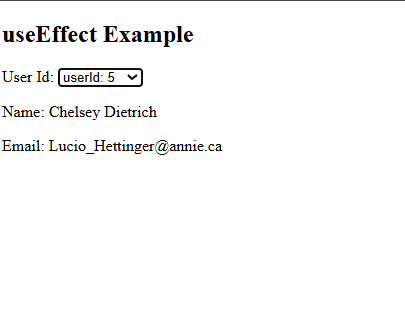

Inter.Q1). What are Components ? <br>

Inter.Q2). What is virtual DOM ? <br>

Inter.Q3). What is the difference btw library and frameworks ? <br>

Inter.Q4). What is an SPA(single page applications) ? <br>

Inter.Q5). What is component based architecture? <br>

Inter.Q6).What is data binding or One-way Data Binding ?

Q7). How do you pass data from parent component to child component ? ~ we can do via a props.

Q8). How to update the state, in the parent component from the child component.

Q9). What is props ? What is props drilling ? can we modify props ? <br> To overcome props drilling we use contextAPI/ redux

Q10). How do you overcome from props drilling ?


Q11). Database design round(ER diagram)

Q12). How do you load a file into your application? <br>
 In frontend -> using ES6 module loader <br>
 In backend -> we are using common JS module loader


Q13). How to update  the state in the parent component from child component ?

- React is passong data in one way i.e from parent component  -> child component. but to pass from child component -> parent component we have to create data in parent component 1st then we can inherit it to child component.
# Questions:

```
Create a UserProfile component which has 3 input fields
- name
- email
- bio

make it as a controlled component.

Once the user clicks on the submit button, then console log the name, email and bio  of the user.

Note: here we will use 3 state variable, 1 form , 1 submit and 3 input type
```


## Interview Questions (component updating examples): React Coding round Questions.

Code:

```
import axios from "axios";
import { useEffect, useState} from "react";

export default function EffectExample2() {

    const userIds = [1,2,3,4,5,6,7,8,9,10];
    const [selectedId, setSelectedId] =  useState("");

    //null is falsy , so we use it here, to print the data if the 
    //data/ userid exist.
    const [user, setUser] = useState(null);

    //effect get called on the inittial render and everytime selectedId changes
    useEffect(() => {
        if(selectedId != ""){
            axios.get(`https://jsonplaceholder.typicode.com/users/${selectedId}`)
            .then((response) => {
                console.log(response.data);
                setUser(response.data);
            })
            .catch((err) => {
                console.log(err);
            })
        }
    }, [selectedId]);

    return(
        <div>
            <h2>useEffect Example</h2>
            <label>User Id: </label>

            {/* I have to show : you have selected userId: 3, 2. */}
            <select value={selectedId} onChange={e => setSelectedId(e.
                target.value)}>
                <option value="">Select</option>
                {userIds.map((ele, index) => {
                    return <option key={index} value={ele}>userId: {ele}</option>
                })}
            </select>

            <br/>

            {/* initial user is null and if it is true then show the 
            data and null is falsy value thats why we use null in state
            variable .
            It will help us to print whatever userid i will select, suppose
            I select userId: 1 then it will show name and email*/}
            {user && (
                <div>
                    <p>Name: {user.name}</p> 
                    <p>Email: {user.email}</p> 
                </div>
            )}
        
            {/* <p>You have selected user with id : {selectedId}</p> */}
        </div>
        
    );
}
```

o/p:  (here there are 10 list of userid and whenever we click on any id , it should show us users email and name)


